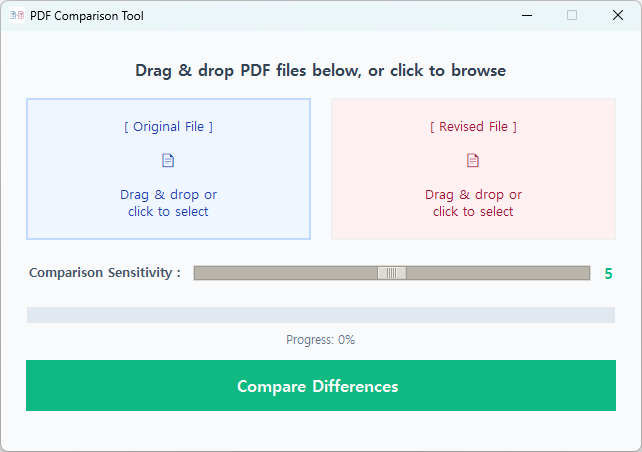
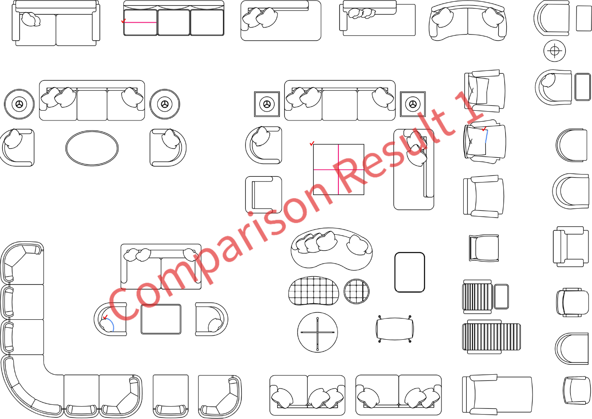
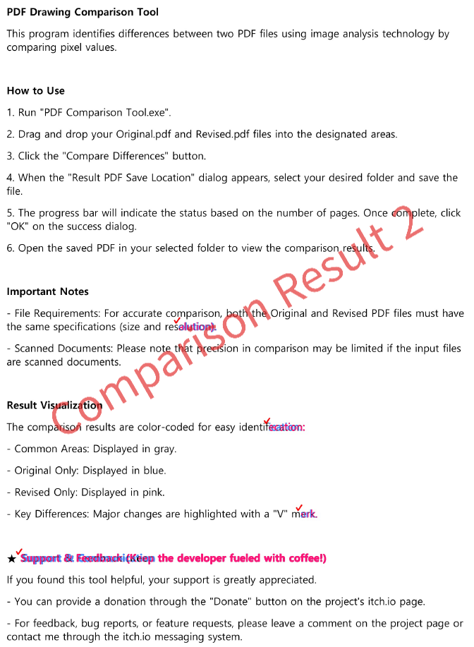

# pdf-comparison-tool
Effortlessly identify differences between two PDF drawings.
Are you tired of manually comparing long PDF documents to spot changes? This tool is designed to save you time and eliminate errors by visually highlighting every modification between your files.

## 🚀 Why You Need This Tool
- **Instant Visual Clarity**: No more squinting at text. We use pixel-level image analysis to color-code your differences—**Blue** for Original-only content and **Pink** for Revised-only content.
- **Handle Large Documents with Ease**: Whether you are working with a few pages or a massive document, our tool efficiently processes and compares every page, ensuring nothing is overlooked.
- **Simple & Reliable**: Designed for professionals who need to confirm edits quickly. Just drag, drop, and compare.

## ✨ Key Features
- **Visual Diff**: Clearly see what was added, removed, or changed.
- **Precision Marking**: Key differences are automatically highlighted with a "V" mark for quick navigation.
- **Wide Compatibility**: Works seamlessly with various PDF documents, providing consistent results every time.

## 📖 How to Use
1. Run the `PDF_Compare.exe`.
2. Simply **drag and drop** the two PDF files you wish to compare into the window.
3. Observe the highlighted differences and use the "V" marks to jump to each change.

## 📸 Preview
To help you understand how our tool highlights differences, take a look at the examples below:

**1. Main Interface**

**2. Comparison Results**
You can clearly distinguish modifications with color-coding:
- **Blue**: Original-only content
- **Pink**: Revised-only content

